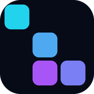

<div align="center">



# Block Fall

**Place blocks, clear lines.** A grid puzzle — free, no ads, no tracking, plays offline.

[](https://github.com/hphun9/blockfall/actions/workflows/ci.yml)
[](https://github.com/hphun9/blockfall/actions/workflows/pages.yml)
[](LICENSE)

</div>

---

## Play

### ▶ [hphun9.github.io/blockfall](https://hphun9.github.io/blockfall/)

Open it and play. No install, no account. Add it to your home screen and it works
with the network off.

### Run it locally

```bash
npm run serve      # http://localhost:8080
npm test           # 35 rule tests
```

No `npm install` needed — the game has no dependencies.

## Rules

Three blocks are offered at a time. Drag one anywhere it fits; filling a whole row
or column clears it. Blocks **cannot be rotated**, so every placement is a decision.
The run ends when none of the three remaining blocks fits anywhere.

No timer, no gravity. You lose by miscalculating, not by reacting too slowly — which
is the appeal of the genre, and it only holds if the deal is honest.

### An honest deal

This is the real design problem. Deal uniformly at random and the board fills with
awkward S/Z pieces until it jams, and the player loses to the dealer rather than to
themselves — which feels terrible.

Two safeguards:

- **Weighted bag**: small, easy pieces are dealt often; awkward ones are rare.
- **Tray rule**: a freshly dealt tray *must* contain at least one placeable piece.
  If it doesn't, the engine reshuffles (up to 12 times).

When the board is genuinely too full to save, the run ends — that loss belongs to the
player, and it replays exactly from the seed.

## What's in it

- **Three skins** — *Nebula* (neon space), *Mochi* (pastel candy), *Prism* (frosted
  glass). Switching mid-run doesn't interrupt anything.
- **Daily mode** — everyone gets the same board each day, down to the deal order.
- **Three undos per run**, and undo rewinds the RNG stream too, so you can't
  undo-redo your way to a better piece.
- **Combos**: clearing on consecutive drops multiplies the score.
- **Clear the whole board** and you get a bonus plus a skin rotation — the rarest
  thing you can do here, so it's worth marking.
- **Drop preview** — see where the piece lands and which lines it would clear.
- **A piece that fits nowhere is dimmed**, so you see the trap coming instead of
  discovering it by trying all three.
- **Occupied cells are never covered** by the preview — the board never lies about
  what's underneath.
- **Vietnamese and English**, auto-detected from the device.
- **Plays offline** (installable as an app), saves the run in progress.
- **No ads, no accounts, nothing leaves the device.** Sound is synthesised with
  WebAudio, so the page makes no third-party requests at all.

## Layout

```
shared/
  skins.json       every colour, radius and spacing for the three skins
  strings.json     every visible string, Vietnamese and English

scripts/
  generate-skins.mjs     skins.json   -> web/styles/skins.css
  generate-strings.mjs   strings.json -> web/src/strings.gen.js
  generate-icons.py      draws the brand mark, PWA icons and social cover

web/                no framework, no bundler, no dependencies
  src/core/         engine.js, pieces.js, rng.js, storage.js  (pure, no DOM)
  src/ui/           board, drag, sound
  styles/           hand-written base.css + generated skins.css
  tests/            node --test
```

The engine knows nothing about the page, and the page implements no rules — which is
why all 35 rule tests run without a browser.

## Origin and licence

Block Fall is an **independent implementation** of the grid block-placement genre. No
source file, stylesheet or asset from any other game is present in this repository.
The rules are *game mechanics*, which copyright does not protect; everything it does
protect — code, art, copy, layout — was written for this project.

Block generation uses mulberry32 (Tommy Ettinger, public domain), shared with
[Orbix](https://github.com/hphun9/orbix) so the whole catalogue relies on one
well-tested generator.

## Licence

[MIT](LICENSE) © 2026 hphun9.
